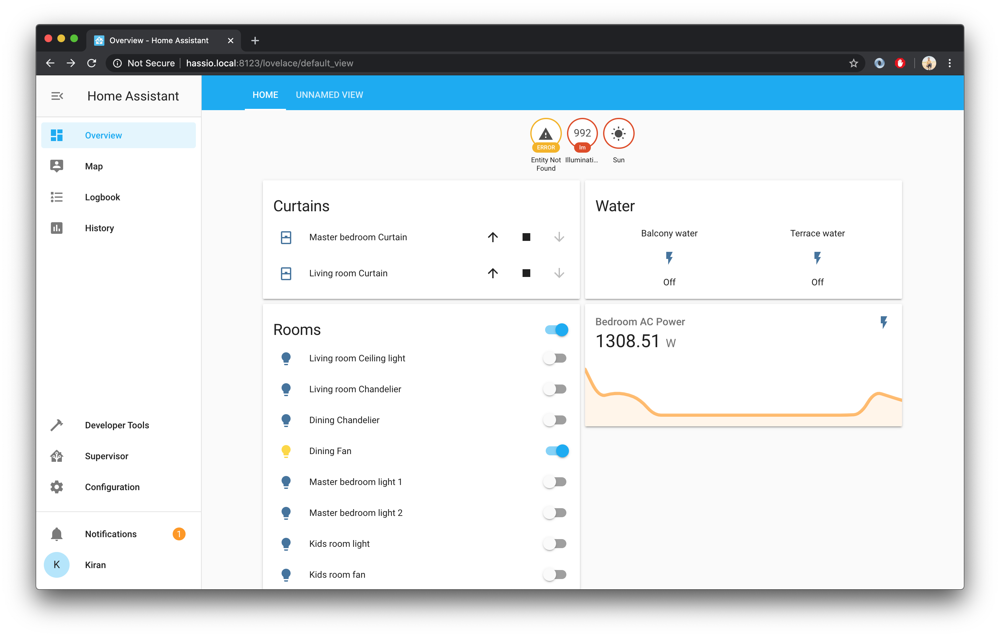

# Introduction
A home assistant (hassio) component for bidirectional communication with BPL IQ home automation controller.
Use it to integrate hassio with BPL home automation, the biggest benefit being google home / alexa automation.

My setup is a raspberry pi 3b running Hass OS, connecting to the BPL controller via a local TCP socket.

Its a raw implementation, just to get things working. Lets call this v0.9 to being with. Things are not stable yet.

# Setup
For setting up, set the `DEFAULT_HOST` in the `light.py` file to the IP of the controller. Port will be the default port of `30001`
Then Set the sensors array to the all the lights and fans at home. Every sensor requires a bpl_id to be set correctly mandatorily.

- `bpl_id` is the `endpoint` XML attribute present in smarthome/zone/device/endpoint in the `sysdb.xml` file. To download this file, connect to your BPL controller via FTP and download this file for e.g ftp://bpl@192.168.1.10/home/root/db/sysdb.xml, default username is `bpl`, password is `123`. 
- `unique_id` is the ID which will be the entity id hassio will use internally (can be anything you wish).
- `name` is a friendly name of the entity which will be shown in the hassio lovelace UI (can be anything you wish)

Copy all the files present in this repo (init.py,light.py,manifest etc)  to custom_components/bpl folder in hassio (create if it doesnt exist, refer to hassio website on how to setup custom components).

# Conclusion
Once you have successfully got this up and running, you can uninstall the crappy BPL app and use HA app instead :)
